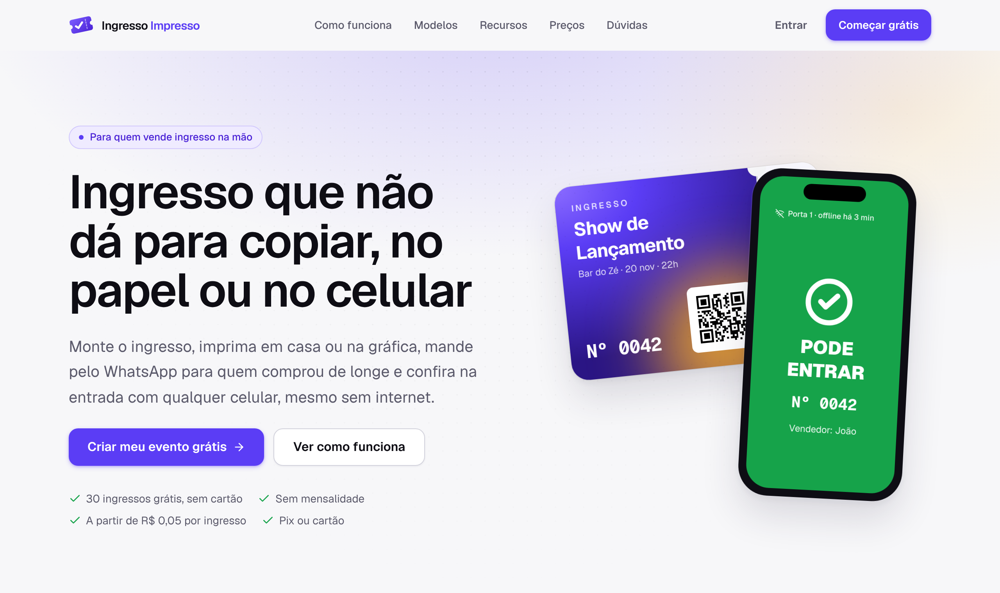
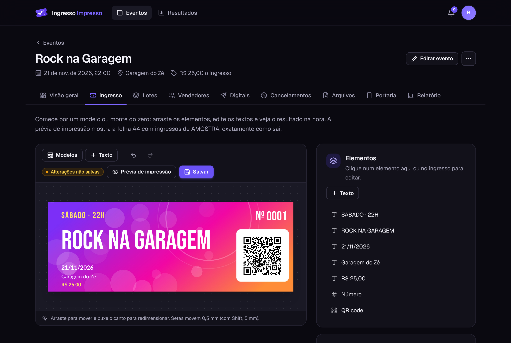
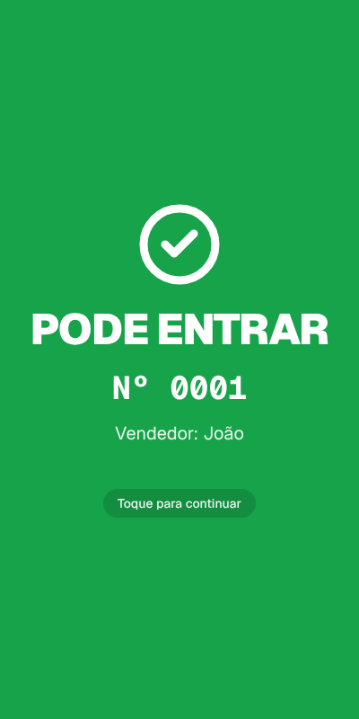
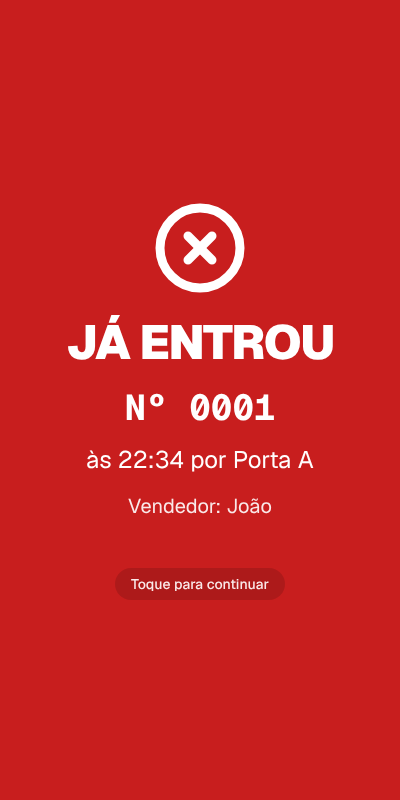
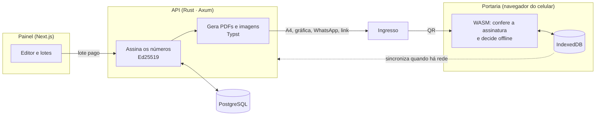

<div align="center">


# Ingresso Impresso

**Ingressos impressos e numerados, com QR code assinado, e check-in na porta pelo navegador do
celular, mesmo sem internet.**

Para bandas independentes, festas de escola, igrejas e pequenos produtores que vendem ingresso na
mão.

[](https://github.com/allansomensi/ingressoimpresso/actions/workflows/ci.yml)
[](LICENSE)


[Site](https://ingressoimpresso.com.br) · [Status](https://ingressoimpresso.com.br/status) ·
[Arquitetura](docs/arquitetura.md) · [Decisões (ADRs)](docs/adr/README.md) ·
[Implantação](docs/deploy.md)



</div>

## O que é

Quem organiza um show na garagem, uma festa junina ou um culto especial costuma vender ingresso de
papel, um a um, por vários vendedores. Na porta, ninguém sabe se aquele papel é original, se já
entrou ou quem vendeu. O Ingresso Impresso resolve isso sem exigir internet nem equipamento:

1. **Monte o ingresso** no editor visual, a partir de 16 modelos, com a sua arte.
2. **Pague só pelo lote de números** que vai usar (Pix ou cartão). Cada número sai com um QR code
   assinado digitalmente, que não dá para falsificar nem copiar sem ser pego.
3. **Imprima** em casa (A4), na gráfica (PDF com sangria) ou **mande pelo WhatsApp** como imagem ou
   link de ingresso digital.
4. **Entregue faixas de números aos vendedores** e acompanhe quem vendeu o quê.
5. **Na porta, qualquer celular vira leitor**: abre um link, lê o QR pela câmera e decide na hora
   (pode entrar, já entrou, cancelado, falso), **mesmo em modo avião**. Quando a rede volta, os
   celulares sincronizam e uma cópia usada em duas portas aparece.

<table>
  <tr>
    <td width="62%"></td>
    <td></td>
    <td></td>
  </tr>
  <tr>
    <td align="center"><sub>Editor do ingresso, com prévia ao vivo</sub></td>
    <td align="center" colspan="2"><sub>A portaria no celular decide sem internet</sub></td>
  </tr>
</table>

## Recursos

**Para quem organiza**
- Editor visual com arrastar, desfazer, oito fontes e campos automáticos (`{evento}`, `{data}`…).
- Arquivos para imprimir em casa, na gráfica (TrimBox/BleedBox) e ZIP para o WhatsApp.
- Ingresso digital por link, que abre no celular do público mesmo offline.
- Vendedores com faixas de números, cancelamentos, relatório por vendedor e resultados do evento.
- Rifas sem sorteio (só a impressão dos números).
- Login sem senha (código por e-mail ou Google) e **verificação em duas etapas** opcional.
- PWA instalável, tema claro/escuro e interface pensada primeiro para o celular.

**Na porta**
- App web offline (service worker + IndexedDB), sem instalar nada.
- Verificação da assinatura Ed25519 e decisão no próprio aparelho, em Rust compilado para
  WebAssembly.
- Vários celulares na mesma porta, sincronizando quando há rede.

**Para quem administra a plataforma**
- Métricas, financeiro, organizações, cortesias, estornos e modo suporte com auditoria.
- Preços editáveis com vigência, promoções, cupons e crédito.
- Pronunciamentos, notificações, modo de manutenção, cadastros e domínios bloqueados.
- Registro de e-mails, moderação das artes (Google Cloud Vision) e página pública de status.

## Como funciona



- O **QR v1** leva o número do ingresso, o evento e uma assinatura **Ed25519**, codificados em
  base45. A chave privada de cada evento fica selada no servidor e nunca sai dele; o celular da
  porta recebe só a chave pública.
- A **deduplicação** é por `(evento, número)`, nunca pelos bytes do QR: a cópia de um ingresso que já
  entrou é barrada como "já entrou".
- Só **lotes pagos** são assinados. Prévias usam um QR de amostra inválido e marca d'água.
- Os mesmos **vetores de teste** (`testdata/vectors`) rodam em Rust e no WebAssembly, garantindo que
  servidor e portaria decidem igual.

Os detalhes estão em [`docs/arquitetura.md`](docs/arquitetura.md) e nas
[45 decisões registradas](docs/adr/README.md).

## Tecnologias

| Parte | Tecnologia |
|---|---|
| Núcleo do ingresso | Rust (`ticket-core`): formato do QR, base45, Ed25519, decisão da portaria; sem IO, compila para `wasm32` |
| Portaria | `ticket-wasm` (wasm-bindgen) + zxing-wasm para ler o QR, IndexedDB, service worker |
| Geração de arquivos | [Typst](https://typst.app) embutido (`ticket-render`), QR vetorial, PDF de gráfica com sangria |
| API | Rust, Axum 0.8, sqlx 0.9 (consultas verificadas em compilação), PostgreSQL |
| Painel e site | Next.js 16, React, TanStack Query, Tailwind CSS 4, TypeScript estrito |
| Tipos | gerados do Rust para TypeScript com ts-rs (nunca escritos à mão) |
| Serviços | Render (API), Vercel (site), Neon (Postgres), Resend (e-mail), Stripe (Pix e cartão), Cloudflare Turnstile |

## Estrutura

```
crates/
  ticket-core/    formato v1, base45, Ed25519, decisão da portaria (puro, sem IO)
  ticket-wasm/    bindings WebAssembly para a portaria (só verifica, nunca assina)
  render/         ingressos em PDF e imagem com Typst; fontes OFL
  server/         API (Axum + sqlx), migrações, worker de arquivos, testes de integração
  cli/            binário `ii`: vetores, render e verificação locais
apps/web/         site, painel, portaria e ingresso digital (Next.js)
packages/
  api-types/          tipos da API gerados do Rust
  ticket-core-wasm/   wrapper TypeScript do WASM
e2e/              portaria ponta a ponta com 5 "celulares" e câmeras falsas (Playwright)
docs/             arquitetura, ADRs, implantação e ensaio geral
```

## Rodando localmente

**Pré-requisitos:** [rustup](https://rustup.rs) (a versão vem de `rust-toolchain.toml`),
Node.js ≥ 22.13 com pnpm 10, [just](https://just.systems), Docker (para o Postgres) e
`wasm-bindgen-cli` 0.2.129:

```sh
cargo install wasm-bindgen-cli --version 0.2.129 --locked
```

**Passo a passo:**

```sh
git clone https://github.com/allansomensi/ingressoimpresso
cd ingressoimpresso
cp .env.example .env
# Gere a chave mestra e cole em TICKET_KEY_ENCRYPTION_KEY no .env:
openssl rand -base64 32

just db-up        # Postgres em Docker
pnpm install
just wasm         # compila a portaria para WebAssembly

just api          # API em http://localhost:8080 (cria as tabelas ao subir)
just web-dev      # site e painel em http://localhost:3000 (em outro terminal)
```

Sem `RESEND_API_KEY`, nenhum e-mail sai: o código de login aparece no log da API. Use o e-mail de
`ADMIN_EMAILS` para ver o painel de administração. Stripe, Google, Turnstile e Cloud Vision são
opcionais; sem eles, o admin marca lotes como pagos e o login é só por código.

**Testar a impressão sem a API:**

```sh
cargo run -p ii-cli -- job init --name "Meu Show"
cargo run -p ii-cli -- render --job job.json --seed event.seed   # out/: A4, gráfica, controle, ZIP
cargo run -p ii-cli -- verify --job job.json --seed event.seed "<texto lido do QR>"
```

## Testes e qualidade

```sh
just        # exatamente o que o CI roda: fmt, clippy, testes Rust, tipos gerados, WASM, lint, Vitest e build
just e2e    # a portaria ponta a ponta: API + site + 5 navegadores com câmera falsa
```

- Criptografia e formato com `proptest` e vetores compartilhados Rust ↔ WASM.
- Servidor com `sqlx::test` em Postgres real.
- Arquivos testados de ida e volta: gerar → rasterizar → ler o QR → verificar a assinatura.
- Clippy `pedantic`, sem `unwrap` fora de testes, TypeScript estrito sem `any`.

## Segurança

- A chave privada de cada evento e a chave do app autenticador ficam cifradas com uma chave mestra
  que nunca vai para o banco nem para os logs.
- Códigos de login, tokens de sessão, links da portaria e códigos de recuperação ficam só como hash.
- O token de acesso da portaria e o do ingresso digital vão no fragmento da URL (`#`), que não
  chega ao servidor.
- Limites por IP e por e-mail, cota diária de e-mails e verificação anti-robô antes de enviar
  códigos.
- Arte sinalizada pela moderação não é impressa até um admin liberar.

Encontrou uma vulnerabilidade? Escreva para **contato@ingressoimpresso.com.br** antes de abrir uma
issue pública. Respondemos em até 5 dias.

## Contribuindo

Contribuições são bem-vindas. Antes de abrir um pull request:

1. Rode `just` e deixe tudo verde.
2. Siga as convenções do [`CLAUDE.md`](CLAUDE.md): código e commits em inglês, interface e
   documentação em português, e commits no formato
   [Conventional Commits](https://www.conventionalcommits.org) com gitmoji
   (`feat(server): ✨ ...`, `fix(web): 🐛 ...`).
3. Uma decisão nova de arquitetura pede um [ADR](docs/adr/README.md) novo. Um ADR aceito não é
   reescrito: um novo o substitui.
4. Respeite as invariantes listadas no `CLAUDE.md`. A principal: o formato QR v1 é imutável.

## Licença

Código sob a [licença MIT](LICENSE). As fontes em `crates/render/fonts` e
`apps/web/public/fonts/ticket` seguem a SIL Open Font License; cada uma acompanha o seu arquivo
`-OFL.txt`.
