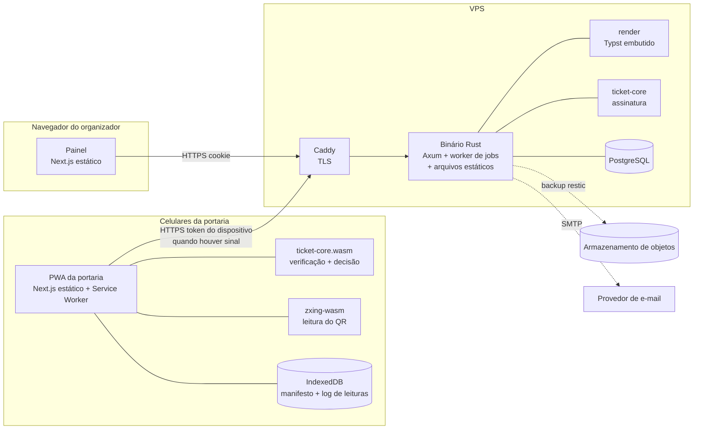
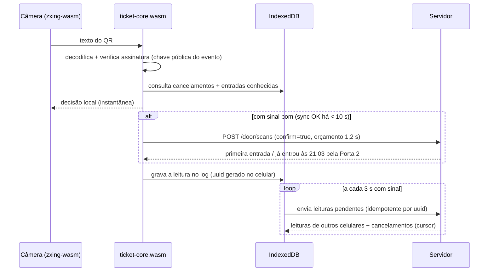

# Arquitetura proposta: Ingresso Impresso

> **Status: proposta aguardando aprovação.** Nada aqui está implementado ainda. Cada decisão
> relevante tem um ADR em [`docs/adr/`](adr/README.md) com as alternativas consideradas.

## 1. Resumo em uma tela

| Tema | Decisão proposta | ADR |
|---|---|---|
| Repositório | Monorepo: Cargo workspace + npm workspaces, `just` como ponto de entrada único (sem Turborepo) | [0001](adr/0001-monorepo.md) |
| Núcleo do ingresso | Crate Rust puro `ticket-core` (sem IO), compilado para WASM e usado pelo servidor e pela portaria | [0002](adr/0002-nucleo-rust-wasm.md) |
| Formato do QR | Binário fixo de 74 bytes → base45 (111 caracteres) → QR alfanumérico versão 5, ECC M | [0003](adr/0003-formato-qr-v1.md) |
| Assinatura | Ed25519, um par de chaves por evento (com `key_id` para rotação); o celular guarda só a chave pública | [0004](adr/0004-assinatura-ed25519.md) |
| Custódia das chaves | Chave privada gerada no servidor e cifrada com XChaCha20-Poly1305 sob uma chave mestra fora do banco | [0005](adr/0005-custodia-chaves.md) |
| Portaria offline | Decisão sempre local e instantânea; log de leituras só-de-acréscimo sincronizado; confirmação online com orçamento de tempo quando há sinal | [0006](adr/0006-portaria-offline-sync.md) |
| Acesso da portaria | Link com token no fragmento (`#`) → registro do celular como dispositivo revogável | [0007](adr/0007-acesso-portaria.md) |
| Arquivos | Typst embutido; dados do usuário entram só como dados (nunca como código Typst); arquivos determinísticos regerados sob demanda, sem armazenamento | [0008](adr/0008-geracao-arquivos-typst.md) |
| Frontend | Next.js com `output: 'export'` (estático) servido pelo próprio binário Axum: sem Node em produção | [0009](adr/0009-frontend-next-export-estatico.md) |
| Leitura de QR | `zxing-wasm` em todos os navegadores (o `BarcodeDetector` não existe no Safari do iPhone) | [0010](adr/0010-leitura-qr-navegador.md) |
| Modelo de dados | Faixas `int4range` com restrições de exclusão; sem tabela com uma linha por ingresso | [0011](adr/0011-modelo-dados-faixas.md) |
| Login do organizador | Código de 6 dígitos por e-mail (sem senha) | [0012](adr/0012-autenticacao-organizador.md) |
| Infraestrutura | Uma VPS: Caddy + binário Rust + PostgreSQL via Docker Compose; backup cifrado (restic) em armazenamento de objetos | [0013](adr/0013-infraestrutura.md) |
| Pagamento Pix | Adiado: o MVP não cobra (eu marco o lote como pago); integração com PSP na fase 6 | [0014](adr/0014-pagamento-pix-adiado.md) |

O que muda em relação às suas hipóteses:

- **Confirmadas:** monorepo, núcleo Rust → WASM, Ed25519 por evento, base45, PWA offline-first e
  Typst embutido.
- **Ajustadas:**
  - **base45:** a vantagem não é compactar (ele usa 8,25 bits por byte, contra 8 do modo byte).
    É ser *seguro como texto*: os leitores de QR do navegador devolvem string, e bytes crus se
    corrompem na decodificação de texto. Entre as codificações seguras como texto, base45 no modo
    alfanumérico é a mais compacta, cerca de 23% menor que base64.
  - **Ed25519:** levei em conta uma alternativa forte (token aleatório + manifesto com hashes, que
    dá um QR bem menor) e optei pela assinatura por dois motivos ligados ao requisito "não pode
    falhar na porta", detalhados no ADR 0004.
  - **Typst:** não exporta PDF/X nem converte imagens para CMYK. A "versão para gráfica" do MVP
    sai em RGB, com sangria e marcas de corte. CMYK/PDF-X ficam para depois.
- **Contestadas:**
  - **Turborepo:** não se paga com um único app JS.
  - **Next.js com servidor Node em produção:** a exportação estática elimina um runtime inteiro.
  - **`BarcodeDetector`:** não funciona no iPhone.
  - **Arquivos gerados:** não guardamos; regeramos sob demanda.

## 2. Visão geral



Em produção há **um processo** (o binário Rust, que serve a API, os arquivos estáticos e roda o
worker de jobs), **um banco** e **um proxy TLS**. Os serviços de terceiros ficam em: VPS, domínio,
SMTP, armazenamento de backup e, na fase 6, o PSP do Pix.

## 3. Estrutura do repositório

```
ingressoimpresso/
├── Cargo.toml                 # workspace Rust (lints compartilhados, versões fixas)
├── rust-toolchain.toml
├── package.json               # npm workspaces
├── justfile                   # ponto de entrada único: just check, just dev, just test...
├── crates/
│   ├── ticket-core/           # formato do QR, base45, assinatura/verificação, decisão de check-in
│   │                          # sem IO, sem async, compila para wasm32
│   ├── ticket-wasm/           # bindings wasm-bindgen do ticket-core (cdylib)
│   ├── render/                # World do Typst, modelos, QR vetorial, PDF/PNG/ZIP
│   ├── server/                # Axum + sqlx + migrações + jobs; binário `ingressoimpresso`
│   └── cli/                   # ferramenta de desenvolvimento/admin: vetores, render local, chaves
├── apps/
│   └── web/                   # Next.js (export estático): landing, painel, portaria (PWA)
├── packages/
│   ├── ticket-core-wasm/      # pacote npm gerado a partir de crates/ticket-wasm (build, não versionado)
│   └── api-types/             # tipos TS gerados dos DTOs Rust (ts-rs), versionados
├── testdata/
│   └── vectors/ticket-v1.json # vetores de teste compartilhados Rust ↔ WASM/TS
├── deploy/                    # Dockerfile, compose.yaml, Caddyfile, backup
└── docs/
    ├── arquitetura.md
    └── adr/
```

Regras de dependência: `ticket-core` não depende de nenhum outro crate do projeto. `render` depende
de `ticket-core`. `server` depende de ambos. O frontend só conhece o `ticket-core` pelo WASM e a
API pelos tipos gerados.

## 4. Formato e segurança do QR

### 4.1 Formato v1

Payload binário de tamanho fixo (74 bytes), inteiros em big-endian:

| Offset | Tamanho | Campo | Observação |
|---|---|---|---|
| 0 | 1 | `version` | `0x01` |
| 1 | 4 | `event_tag` | u32 aleatório, único por evento; dica para achar o evento (não é segredo) |
| 5 | 1 | `key_id` | geração da chave do evento (rotação) |
| 6 | 4 | `ticket_number` | u32, começa em 1 |
| 10 | 64 | `signature` | Ed25519 sobre a mensagem abaixo |

Mensagem assinada (separação de domínio e vínculo com o UUID completo do evento, que não vai no QR):

```
"ingressoimpresso:ticket:v1" || event_id (UUID, 16 bytes) || payload[0..10]
```

Texto do QR = `base45(payload)` (RFC 9285), 111 caracteres. No modo alfanumérico com correção M,
cabe na **versão 5 (37×37 módulos)**, cuja capacidade é 122. Com a zona de silêncio de 4 módulos,
um QR de 25 mm fica com cerca de 0,55 mm por módulo, folgado para impressão caseira e para a tela
do celular. O editor vai impor no mínimo 22 mm e fundo branco sob o QR.

Regras do decodificador (todas cobertas por testes de propriedade):

- Aceita só base45 canônico em maiúsculas. Rejeita qualquer comprimento diferente de 111 e
  `version` desconhecida.
- Verifica com `verify_strict` (sem maleabilidade). Mesmo assim, **a chave de deduplicação é
  `(evento, número)`, nunca os bytes do QR**.
- Nunca entra em pânico com entrada arbitrária. Sem `unwrap` e sem indexação direta no
  `ticket-core` (o lint `clippy::indexing_slicing` fica como erro nesse crate).
- As assinaturas Ed25519 são determinísticas (RFC 8032): o mesmo ingresso sempre gera o mesmo QR.
  Isso permite reimprimir e regerar arquivos byte a byte e ter vetores de teste estáveis.

### 4.2 Modelo de ameaças

| Ameaça | Resultado |
|---|---|
| Criar um ingresso sem a chave privada | Inviável (EUF-CMA do Ed25519) |
| Extrair dados do celular da portaria | O atacante obtém a chave pública, os cancelamentos e as leituras: **não consegue falsificar**. Com o segredo do dispositivo, poderia registrar leituras falsas até o organizador revogá-lo |
| Vazamento do link da portaria | Mesmo caso anterior. Mitigado por expiração, revogação e lista de dispositivos visível no painel |
| Cópia de ingresso válido (foto, encaminhamento no WhatsApp, xerox) | A primeira leitura entra; as seguintes são bloqueadas. Limite offline na seção 5.3 |
| Ingresso de outro evento | `event_tag`/chave não batem: "ingresso de outro evento" |
| Gerar ingressos sem pagar | O servidor **só assina lotes pagos**. A prévia usa um QR de amostra inválido e marca d'água "AMOSTRA" |
| Bloco perdido ou não vendido | Cancelamento por faixa: o número é bloqueado na porta |
| Vendedor que imprime duas vezes o mesmo número | A segunda cópia é bloqueada, e o relatório atribui a tentativa à faixa daquele vendedor |
| Comprometimento do servidor | Permite falsificar. Mitigação: chaves cifradas, superfície mínima, revogação do `key_id` e reemissão. Esse limite é honesto: não há como evitá-lo sem hardware dedicado |

## 5. Portaria offline e sincronização

### 5.1 Fluxo



- **A decisão local nunca espera a rede.** Ela usa a assinatura, os cancelamentos e as entradas já
  conhecidas (as locais e as recebidas de outros celulares).
- **Confirmação online:** quando há sinal bom, a leitura é confirmada no servidor por um
  `INSERT ... ON CONFLICT` atômico na tabela `entries`, com orçamento de 1,2 s. Se o tempo acabar,
  vale a decisão local e a leitura fica pendente. Depois de três estouros seguidos, o celular passa
  30 s em modo offline, para não travar a fila.
- **Log de leituras:** é um conjunto só-de-acréscimo (G-Set) identificado por UUID. A fusão é a
  união, então a convergência é trivial e não precisa de biblioteca de CRDT. Cancelamentos e
  atribuições são do servidor e vêm inteiros a cada sync (são pequenos); as leituras vêm de forma
  incremental.
- **Cursor seguro:** sequências do Postgres podem fazer commit fora de ordem. Cada linha guarda o
  `pg_current_xact_id()`, e o servidor só entrega linhas abaixo do `xmin` do snapshot atual (padrão
  outbox). O cliente ainda deduplica pelo UUID.
- **Lote novo gerado depois do último sync:** é aceito, porque a assinatura prova que foi emitido.
  O vendedor aparece como "lote novo" até a próxima sincronização.
- **Releitura do mesmo QR em até 5 s no mesmo celular** (a pessoa ainda está na frente da câmera):
  reexibe o resultado anterior sem registrar outra leitura.
- **Tela de resultado:** cor de tela cheia, som (Web Audio) e vibração quando houver suporte (o
  iPhone não vibra pela web). Os resultados possíveis:
  - verde: **válido**;
  - vermelho: **já entrou** (hora e porta), **cancelado** (motivo) ou **falso/ilegível**;
  - amarelo: **outro evento**.

### 5.2 Prontidão para ficar offline

A tela da portaria tem uma lista de verificação que precisa ficar toda verde antes do evento:

- app em cache (Service Worker controlando a página);
- dados do evento baixados, com a hora da atualização;
- permissão de câmera concedida;
- armazenamento persistente pedido com `navigator.storage.persist()`;
- leitura de teste de um ingresso de amostra.

O Safari do iPhone pode apagar dados de sites não instalados depois de 7 dias sem uso. A
instrução, portanto, é **abrir o link no dia do evento, com internet** (ou adicionar à tela de
início).

### 5.3 Garantias e limites, sem eufemismo

| Situação | O que acontece |
|---|---|
| Todos os celulares com sinal | Cópia bloqueada já na segunda leitura, em qualquer celular (confirmação atômica no servidor) |
| Um celular só, offline | Cópia bloqueada (estado local) |
| Vários celulares offline, cópias lidas **no mesmo** celular | Bloqueada |
| Vários celulares offline, cópias lidas **em celulares diferentes** | **As duas entram.** O caso é detectado no primeiro sync em que os dois logs chegam ao servidor e aparece no relatório como "entrada duplicada offline", com hora, celular e vendedor da faixa |
| Cancelamento feito depois que o celular ficou offline | O celular não sabe; a entrada é marcada depois como "entrou com ingresso cancelado" |
| Sinal intermitente | A janela de risco é o intervalo entre syncs (cerca de 3 s), e a confirmação online cobre os momentos de sinal bom |
| Celular perdeu o cache do app e está sem internet | O app não abre. Mitigação: lista de prontidão e um segundo celular preparado |

O limite da linha 4 é **inerente**. Sem rede, navegadores não conseguem conversar entre si
(WebRTC exige sinalização, Web Bluetooth não existe no iPhone e não há descoberta de rede local).
Mitigações no MVP:

1. Orientação no app: sem sinal, use **um celular por fila**. Se houver mais de um dispositivo
   registrado e este estiver offline há mais de 2 minutos, a tela mostra um aviso.
2. Visibilidade: o contador "N leituras não sincronizadas · offline há X min" fica sempre à vista.
3. Rastreabilidade: o relatório mostra duplicatas por faixa de vendedor.

Pesquisa futura (fora do MVP): sincronização entre celulares por QR animado (um celular mostra, o
outro lê) ou por WebRTC em hotspot local com sinalização trocada via QR.

## 6. Geração de arquivos

- **Especificação do ingresso** (`ticket_designs.spec`, JSON versionado e imutável): tamanho em mm,
  sangria (3 mm), arte, caixa do número (posição, fonte embutida, tamanho, cor, alinhamento,
  prefixo "Nº", dígitos), caixa do QR (posição e tamanho ≥ 22 mm, sempre com fundo branco), canhoto
  opcional (lado, largura, campos "Nome/Telefone") e textos extras.
- **Saídas:**
  1. **A4 caseiro:** N ingressos por folha, com o encaixe calculado, marcas de corte e linha
     tracejada de picote entre canhoto e ingresso. Pode ser gerado por vendedor.
  2. **Gráfica:** um ingresso por página no tamanho final + sangria + marcas de corte.
     Pós-processamento com `lopdf` para definir TrimBox/BleedBox. Por ora em RGB; CMYK (lcms2) e
     PDF/X ficam para a fase 7.
  3. **Folha de controle por vendedor:** tabela com número, nome do comprador e "pago?". Ela
     complementa o canhoto.
  4. **WhatsApp:** PNG de 1080 px por ingresso, sem sangria nem canhoto, em um ZIP com uma pasta
     por vendedor, mais o aviso "envie cada imagem a um só comprador".
- **QR:** a matriz é calculada em Rust e vira **SVG com um único `path`** (vetorial no PDF, nítido
  em qualquer impressora), entregue ao Typst como arquivo virtual. Não usamos pacotes Typst
  baixados da internet.
- **Segurança do template:** os templates são nossos e ficam compilados no binário. O texto do
  usuário (nome do evento, nomes de vendedores) entra **só via `sys.inputs`/JSON**, nunca
  concatenado no código Typst. Isso evita injeção de código Typst.
- **Determinismo:** as entradas (spec versionada + arte + números + assinaturas determinísticas)
  definem a saída por completo. Por isso **não armazenamos os arquivos gerados**: há um cache em
  disco com limite de tamanho, indexado pelo hash das entradas, e qualquer arquivo pode ser regerado.
- **Execução:** gerar 1.000 ingressos pode levar alguns segundos. A geração roda como **job em
  fila no Postgres** (`SELECT ... FOR UPDATE SKIP LOCKED`) no mesmo processo, via
  `spawn_blocking`. Não há Redis nem worker separado.
- **Prévia fiel:** o editor mostra uma sobreposição HTML para arrastar, mas a prévia oficial é um
  PNG renderizado pelo mesmo pipeline Typst ("o que você vê é o que imprime").
- **Fontes:** um punhado de fontes OFL embutidas com `include_bytes!`.

## 7. Modelo de dados

Esboço. A versão definitiva sai nas migrações da fase 3.

```sql
create extension if not exists btree_gist;
create extension if not exists citext;

-- Contas
create table organizations (id uuid primary key, name text not null, created_at timestamptz not null default now());
create table users (id uuid primary key, email citext not null unique, display_name text, created_at timestamptz not null default now());
create table memberships (organization_id uuid references organizations, user_id uuid references users,
  role text not null check (role in ('owner','member')), primary key (organization_id, user_id));
create table login_codes (id uuid primary key, email citext not null, code_hash bytea not null,
  expires_at timestamptz not null, attempts smallint not null default 0, consumed_at timestamptz);
create table sessions (token_hash bytea primary key, user_id uuid not null references users,
  created_at timestamptz not null default now(), expires_at timestamptz not null, last_seen_at timestamptz);

-- Evento e chaves
create table events (
  id uuid primary key, organization_id uuid not null references organizations,
  name text not null, venue text, starts_at timestamptz not null, ends_at timestamptz not null,
  qr_tag bigint not null unique check (qr_tag between 0 and 4294967295),
  number_digits smallint not null default 4, ticket_price_cents integer,
  status text not null check (status in ('draft','active','closed')),
  created_at timestamptz not null default now());
create table event_signing_keys (
  event_id uuid references events, key_id smallint check (key_id between 0 and 255),
  public_key bytea not null check (length(public_key) = 32),
  sealed_private_key bytea not null,
  status text not null check (status in ('active','retired','revoked')),
  created_at timestamptz not null default now(), primary key (event_id, key_id));

-- Arte e layout (versões imutáveis)
create table blobs (id uuid primary key, sha256 bytea not null unique, content_type text not null,
  byte_size integer not null, data bytea not null, created_at timestamptz not null default now());
create table ticket_designs (id uuid primary key, event_id uuid not null references events,
  version integer not null, spec jsonb not null, art_blob_id uuid references blobs,
  created_at timestamptz not null default now(), unique (event_id, version));

-- Lotes, vendedores, cancelamentos: tudo em faixas
create table ticket_batches (
  id uuid primary key, event_id uuid not null references events,
  numbers int4range not null, design_id uuid not null references ticket_designs, key_id smallint not null,
  status text not null check (status in ('awaiting_payment','paid','canceled')),
  price_cents integer not null, created_at timestamptz not null default now(), paid_at timestamptz,
  exclude using gist (event_id with =, numbers with &&) where (status <> 'canceled'));
create table sellers (id uuid primary key, event_id uuid not null references events, name text not null, phone text);
create table seller_assignments (
  id uuid primary key, event_id uuid not null references events, seller_id uuid not null references sellers,
  numbers int4range not null, created_at timestamptz not null default now(),
  exclude using gist (event_id with =, numbers with &&));
create table ticket_voids (
  id uuid primary key, event_id uuid not null references events, numbers int4range not null,
  reason text not null check (reason in ('unsold','lost','revoked')), note text,
  created_by uuid references users, created_at timestamptz not null default now(),
  undone_at timestamptz, undone_by uuid references users);

-- Portaria
create table door_accesses (id uuid primary key, event_id uuid not null references events, label text not null,
  token_hash bytea not null unique, expires_at timestamptz not null, revoked_at timestamptz,
  created_at timestamptz not null default now());
create table door_devices (id uuid primary key, door_access_id uuid not null references door_accesses,
  event_id uuid not null references events, name text not null, secret_hash bytea not null,
  created_at timestamptz not null default now(), last_seen_at timestamptz, revoked_at timestamptz);
create table scans (                                  -- log só-de-acréscimo (G-Set)
  id uuid primary key,                                -- gerado no celular → envio idempotente
  event_id uuid not null references events, device_id uuid not null references door_devices,
  ticket_number integer, key_id smallint,             -- nulos se o QR for ilegível ou falso
  local_outcome text not null check (local_outcome in
    ('admitted','rejected_used','rejected_void','rejected_invalid','rejected_other_event')),
  scanned_at timestamptz not null,                    -- relógio do celular corrigido pelo offset
  received_at timestamptz not null default now(),
  confirmed_online boolean not null,
  server_class text check (server_class in ('first_entry','duplicate_entry','void_entry')),
  txid xid8 not null default pg_current_xact_id());   -- cursor seguro de sincronização
create table entries (                                -- primeira entrada de cada ingresso
  event_id uuid references events, ticket_number integer,
  first_scan_id uuid not null references scans, primary key (event_id, ticket_number));

-- Jobs (geração de arquivos, e-mails)
create table jobs (id uuid primary key, kind text not null, payload jsonb not null,
  status text not null check (status in ('queued','running','done','failed')),
  attempts smallint not null default 0, run_after timestamptz not null default now(),
  locked_at timestamptz, result jsonb, error text, created_at timestamptz not null default now());
```

O ingresso nº 42 não tem uma linha própria. O estado dele é derivado assim:

- **emitido:** está em um lote pago;
- **vendedor:** dono da atribuição cuja faixa contém o número;
- **cancelado:** existe um cancelamento ativo que contém o número;
- **entrou:** existe linha em `entries`.

Todas as consultas usam índice GiST.

**Relatório por vendedor:**

- atribuídos;
- devolvidos (`unsold`);
- extraviados (`lost`);
- **vendidos declarados** = atribuídos − devolvidos − extraviados;
- entradas;
- entradas duplicadas offline;
- cópias bloqueadas na porta;
- **valor a acertar** = vendidos declarados × preço, se o preço estiver configurado.

O relatório tem ainda uma linha para os números não atribuídos e totais gerais.

## 8. API (esboço)

Organizador (cookie de sessão, mesma origem):

```
POST   /api/auth/code                 POST /api/auth/verify          POST /api/auth/logout   GET /api/me
GET    /api/events                    POST /api/events               GET|PATCH /api/events/{id}
POST   /api/events/{id}/art           PUT  /api/events/{id}/design   GET /api/events/{id}/design/preview.png
POST   /api/events/{id}/batches       POST /api/admin/batches/{id}/mark-paid          (MVP, só admin)
POST   /api/events/{id}/sellers       POST /api/events/{id}/assignments
POST   /api/events/{id}/voids         POST /api/voids/{id}/undo
POST   /api/events/{id}/exports       GET  /api/jobs/{id}            GET /api/exports/{id}/download
GET    /api/events/{id}/report
POST   /api/events/{id}/door-accesses DELETE /api/door-accesses/{id} GET|DELETE /api/events/{id}/devices[/{id}]
```

Portaria (`Authorization: Bearer <device_secret>`):

```
POST   /api/door/register      { access_token, device_name } → { device_id, device_secret, event }
GET    /api/door/manifest?since=<cursor> → { event, keys[], voids[], assignments[], scans[], cursor, server_time }
POST   /api/door/scans         { scans: [...], confirm?: bool } → { results: [{ id, server_class, first_entry? }] }
```

Os DTOs são structs Rust com `#[derive(TS)]` (`ts-rs`), e os tipos TS são gerados em
`packages/api-types`. Um teste do CI falha se os tipos gerados estiverem desatualizados.

## 9. Frontend

- **Um único app Next.js** (`apps/web`) com `output: 'export'`, TS strict, ESLint com
  `no-explicit-any: error`, Tailwind e Vitest. Os testes E2E usam Playwright, cujo Chromium aceita
  vídeo falso para a câmera (`--use-file-for-fake-video-capture`), o que permite testar a leitura
  de QR de ponta a ponta.
- **Rotas:**
  - `/`: landing;
  - `/entrar`: login;
  - `/painel/...`: área do organizador. Os IDs vão em query string (`/painel/evento?id=...`),
    porque o export estático não aceita segmentos dinâmicos sem `generateStaticParams`;
  - `/portaria`: PWA, com o Service Worker no escopo `/portaria/`.
- **Portaria:** o Service Worker faz precache do shell, do `ticket-core.wasm` e do `zxing.wasm`,
  todos servidos por nós (o `zxing-wasm` busca o `.wasm` em CDN por padrão; é preciso configurar
  `locateFile`). O IndexedDB é acessado via `idb`. A sincronização roda em primeiro plano enquanto
  a tela está aberta (não há Background Sync no iPhone), e a tela mantém o Wake Lock ativo.
- **Textos centralizados:** `apps/web/src/texts/pt-BR.ts` (objeto tipado `as const`). No Rust, os
  textos de e-mail e PDF ficam em módulos `texts.rs`. Não há framework de i18n.

## 10. Infraestrutura e operação

- **Uma VPS** (de preferência em São Paulo) com Docker Compose: `caddy` (TLS automático), `app`
  (binário Rust + `apps/web/out`) e `postgres`.
- **Backup:** `pg_dump` diário cifrado com `restic` para armazenamento de objetos compatível com
  S3, com retenção de 30 dias e teste de restauração mensal (comando no `justfile`). A chave mestra
  das assinaturas e a senha do restic ficam **fora** do backup, no gerenciador de senhas.
- **Observabilidade mínima:** `tracing` em JSON no stdout, `/healthz` e um monitor externo de
  disponibilidade (opcional). A portaria guarda os erros no IndexedDB e os envia junto com o sync.
- **Configuração:** variáveis de ambiente lidas uma vez em uma struct tipada e validada na
  inicialização (o processo falha cedo se algo estiver errado).

## 11. Testes e qualidade

- **Lints Rust no workspace:**
  - `clippy::unwrap_used`, `expect_used` e `panic` como erro (liberados em testes via
    `clippy.toml`);
  - `indexing_slicing` como erro no `ticket-core`;
  - `unsafe_code = "forbid"`, exceto no `ticket-wasm`, porque o código gerado pelo wasm-bindgen
    usa `unsafe`.
- **ticket-core:**
  - testes de propriedade (`proptest`): ida e volta da codificação; qualquer bit alterado é
    rejeitado; assinatura de outro evento é rejeitada; entrada arbitrária nunca causa pânico;
    base45 é canônico;
  - **vetores compartilhados** em `testdata/vectors/ticket-v1.json`, positivos e negativos, a
    partir de sementes fixas. Os mesmos vetores rodam no `cargo test` e no Vitest contra o WASM
    compilado;
  - fuzzing do decodificador com `cargo-fuzz` (opcional, fase 1).
- **server:** testes de integração contra um Postgres real (`sqlx::test`), cobrindo a confirmação
  atômica, a fusão de logs e o cursor seguro.
- **render:** testes de snapshot nos metadados do PDF (contagem de páginas, caixas) e de PNGs em
  baixa resolução. Há também um teste que **decodifica o QR renderizado** e verifica a assinatura,
  fechando o ciclo gerar → ler.
- **CI (GitHub Actions):** `just check` roda fmt, clippy, testes Rust, build WASM, vetores no
  Vitest, typecheck, lint e build do web.

## 12. Fases até o MVP

Estimativas grosseiras, para quem tem 5 a 10 h por semana.

| Fase | Entrega | Critério de pronto | Esforço |
|---|---|---|---|
| **0. Fundação** | Esqueleto do monorepo, `justfile`, CI, compose de dev com Postgres, lints | `just check` verde no CI com crates e app vazios | ~5 h |
| **1. Núcleo do ingresso** | `ticket-core` (formato v1, base45, Ed25519, decisão de check-in) + `ticket-wasm` + vetores | Propriedades e vetores passando em Rust e no WASM/Vitest | ~15 h |
| **2. Geração de arquivos** | `render` + CLI `ii render spec.json`: A4, gráfica, PNG/ZIP e folha de controle | Imprimir uma folha em casa e ler o QR com o celular (teste automatizado de ida e volta) | ~25 h |
| **3. API + painel mínimo** | Login por código, evento, arte + layout por formulário com prévia, lotes (pago manualmente), vendedores, cancelamentos, downloads | Criar um evento real de ponta a ponta pelo navegador | ~30 h |
| **4. Portaria PWA** | Acesso por link, registro do dispositivo, manifesto, leitura, decisão offline, sync, confirmação online, lista de prontidão | Três celulares (Android + iPhone) em modo avião lendo, depois sincronizando e convergindo | ~30 h |
| **5. Relatório + produção** | Relatório por vendedor, deploy na VPS, backup testado, ensaio geral | Ensaio com cerca de 50 ingressos impressos e duas portas | ~15 h |
| **MVP: show da banda** | | | **~120 h** |
| 6. Pix | PSP com cobrança dinâmica + webhook, preço por lote | Pagar um lote real e receber os arquivos sem intervenção | |
| 7. Editor visual e gráfica | Arrastar e redimensionar no editor, templates prontos, CMYK/PDF-X | | |
| 8. Abertura para clientes | Convite de membros, termos/LGPD, landing, limites de abuso | | |

**Atalho, se o show for antes disso:** a fase 3 pode sair sem painel. O evento seria criado por
comandos da CLI admin contra o banco, e o servidor teria só a API da portaria. Assim, o caminho
0 → 1 → 2 → 4 entrega ingressos impressos e uma portaria offline em cerca de 80 h.

## 13. Riscos e questões em aberto

- **Data do show:** define se seguimos o caminho completo ou o atalho.
- **Câmeras ruins / pouca luz:** a mitigação é usar a lanterna (`torch`, quando houver suporte),
  QR grande e correção M. O plano B, digitar o número, verifica só o estado (cancelado/usado) e
  **não a autenticidade**; nesse caso a entrada é marcada como "manual".
- **Atualizações do Typst quebram a API com frequência:** a versão fica fixa e todo uso fica
  isolado no crate `render`.
- **Escolha do PSP do Pix:** fica para a fase 6, comparando taxas, exigência de CNPJ e webhook.
- **Mais de uma fila sem sinal:** é um limite do produto que precisa ser comunicado ao organizador
  na própria interface.
